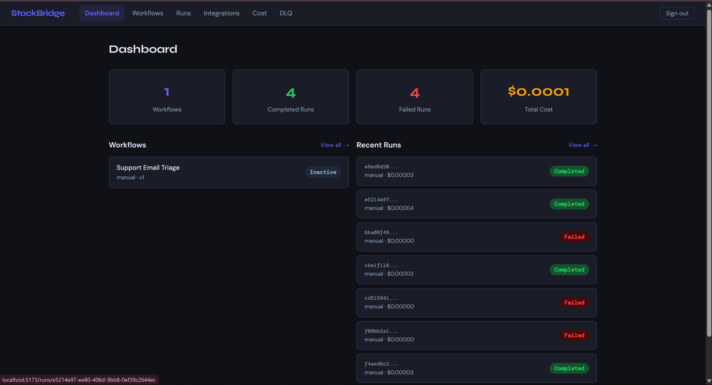
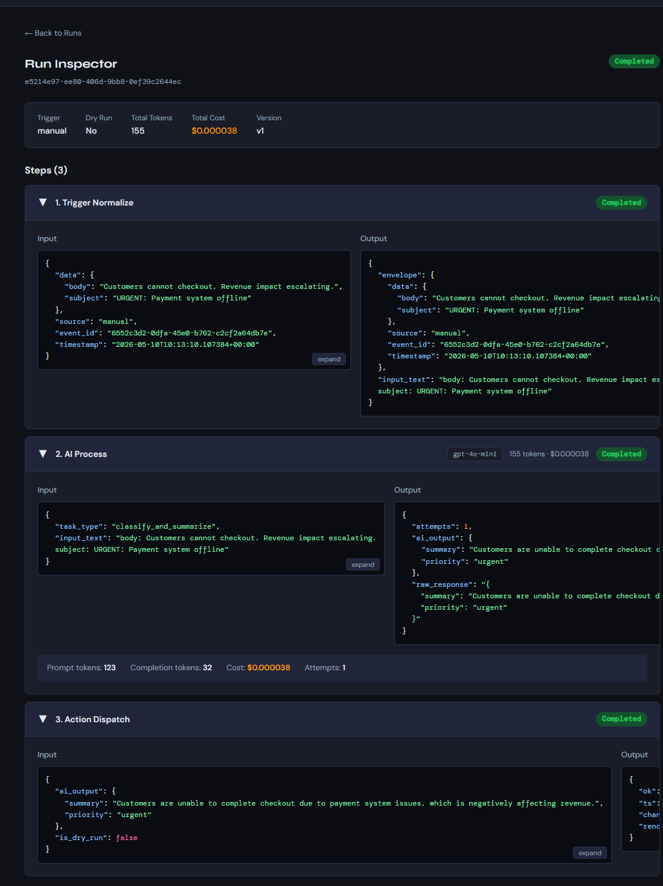
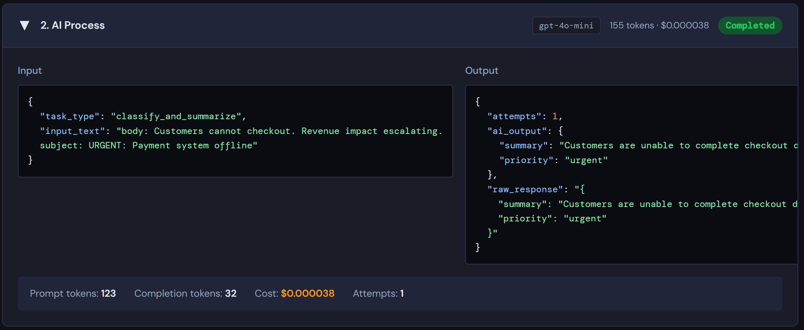
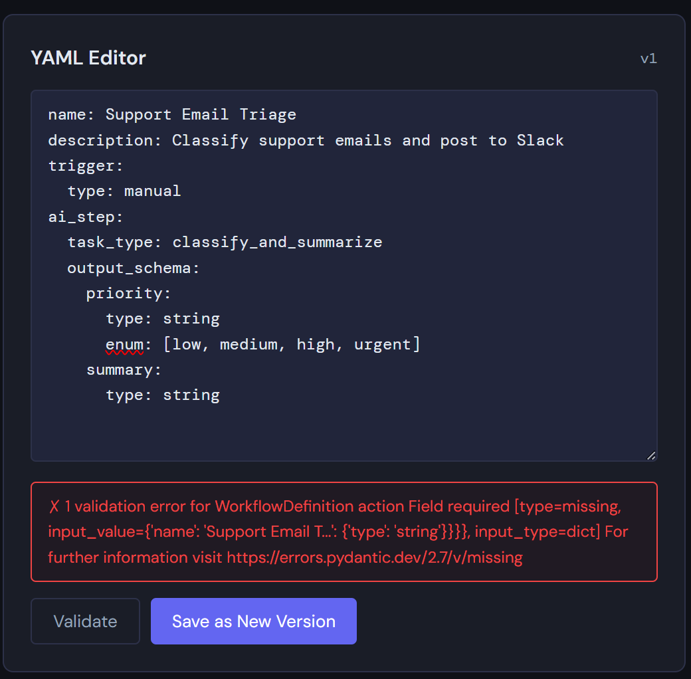
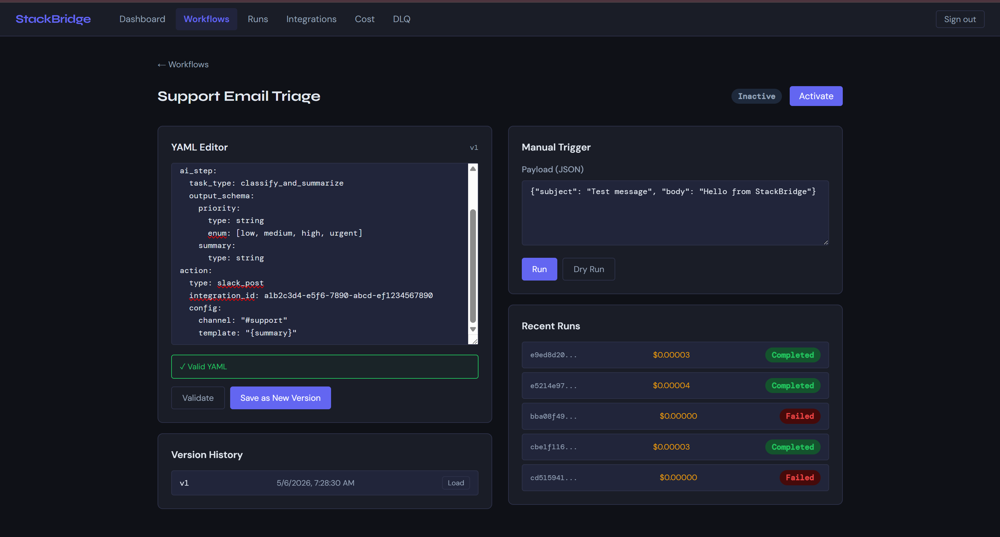
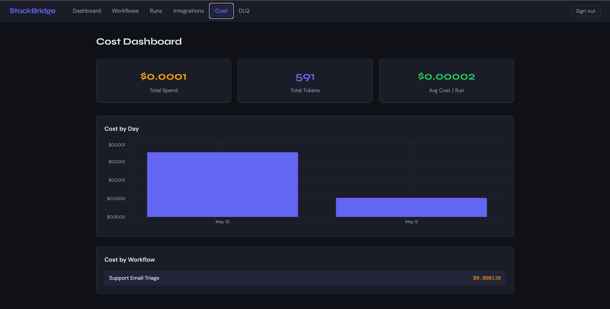
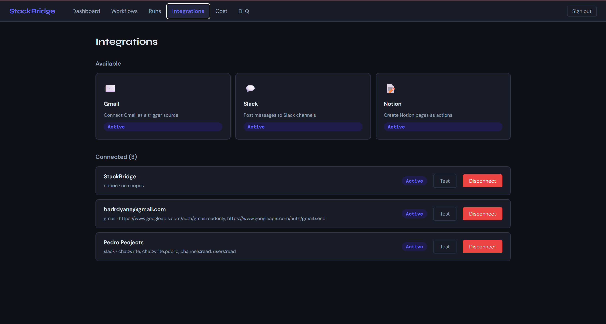
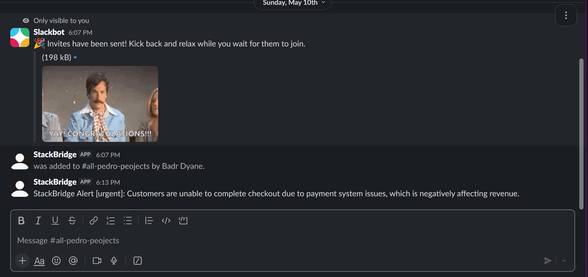

# StackBridge — AI-Powered Integration & Automation Platform

> Connect the SaaS tools businesses already use, with AI as the intelligent middle layer. Triggers, AI processing, and actions — composable, observable, reliable.



---

## What It Does

StackBridge lets you define workflows as **trigger → AI step → action** in YAML. When a trigger fires (Gmail email, manual, scheduled), the AI step classifies, extracts, or summarizes the input, and the action dispatches the result to Slack, Notion, or Gmail.

Every step is logged, costed, and inspectable. Every run can be replayed. Every prompt is versioned.

---

## Demo Walkthrough

### 1. Dashboard — workflow overview and recent runs


### 2. Run Inspector — full step-by-step audit trail

Every run shows all 3 steps with status, tokens used, cost, and expandable JSON payloads.



### 3. AI Step Detail — token usage and structured output

The AI step shows the exact model used, prompt/completion tokens, cost, and the structured JSON output the LLM produced.



### 4. Workflow Editor — live YAML validation

The editor validates YAML on blur and shows inline errors with the exact validation message.



### 5. Version History — every change tracked

Save a new version on every edit. Load any previous version with one click.



### 6. Cost Dashboard — full spend visibility

Token spend aggregated by day (bar chart) and broken down by workflow.



### 7. Integrations — OAuth connections

Gmail, Slack, and Notion connected via OAuth 2.0 with encrypted token storage.



### 8. Slack Action — AI-generated message posted

The workflow AI output rendered into a Slack message template and posted to the channel.



---

## Example Workflow Definition

```yaml
name: Support Email Triage
description: Classify support emails and post to Slack with priority
trigger:
  type: polling
  platform: gmail
  integration_id: your-gmail-integration-id
  interval_seconds: 300
ai_step:
  task_type: classify_and_summarize
  model: gpt-4o-mini
  output_schema:
    priority:
      type: string
      enum: [low, medium, high, urgent]
    summary:
      type: string
action:
  type: slack_post
  integration_id: your-slack-integration-id
  config:
    channel: C0B2H6JDX6V
    template: "StackBridge Alert [{priority}]: {summary}"
```

---

## Architecture
┌─────────────────────────────────────────────────────────────────┐
│  React + Vite Frontend (port 5173)                              │
│  Dashboard · Run Inspector · Workflow Editor · Cost Dashboard   │
└───────────────────────────┬─────────────────────────────────────┘
│ REST API
▼
┌─────────────────────────────────────────────────────────────────┐
│  FastAPI Backend (port 8000)                                    │
│                                                                 │
│  ┌──────────────┐  ┌──────────────┐  ┌──────────────────────┐  │
│  │  Auth + JWT  │  │  Workflow    │  │  Run Engine          │  │
│  │              │  │  CRUD + YAML │  │  trigger → AI → action│  │
│  └──────────────┘  └──────────────┘  └──────────────────────┘  │
│                                                                 │
│  ┌──────────────┐  ┌──────────────┐  ┌──────────────────────┐  │
│  │  OAuth       │  │  APScheduler │  │  Cost Tracker        │  │
│  │  Gmail/Slack │  │  Gmail Poll  │  │  per step + run      │  │
│  │  /Notion     │  │  SQLite jobs │  │                      │  │
│  └──────────────┘  └──────────────┘  └──────────────────────┘  │
└───────────┬───────────────────────────────────────┬────────────┘
│                                       │
▼                                       ▼
┌───────────────────────┐               ┌───────────────────────┐
│  PostgreSQL (port 5433)│               │  OpenAI API           │
│  10 tables            │               │  gpt-4o-mini          │
│  Docker container     │               │  direct REST (httpx)  │
└───────────────────────┘               └───────────────────────┘

---

## Tech Stack

| Layer | Technology |
|---|---|
| Frontend | React 18, Vite, React Router, Recharts, pure CSS variables |
| Backend | FastAPI, Python 3.11, Pydantic v2, SQLAlchemy 2.0 async |
| Database | PostgreSQL 15 (Docker), Alembic migrations |
| AI | OpenAI GPT-4o-mini via direct REST (httpx) |
| Auth | JWT (access + refresh tokens), Argon2 password hashing |
| OAuth | Gmail, Slack, Notion — AES-256-GCM encrypted token storage |
| Scheduler | APScheduler with SQLite job store |
| Integrations | Gmail API, Slack API, Notion API |

---

## Key Engineering Decisions

**Hand-rolled agent orchestration** — no LangChain or framework abstractions. The AI processor implements its own corrective retry loop: if the LLM output fails schema validation, it injects the validation error back into the prompt and retries (up to 3 attempts). This gives full control over cost, latency, and failure handling.

**AES-256-GCM token encryption** — all OAuth tokens are encrypted at rest using a 32-byte key from the environment. The IV is prepended to the ciphertext and stored as base64. No plaintext tokens ever touch the database.

**Gmail History API polling** — uses Gmail's `historyId` cursor instead of fetching all messages on each poll. Only new message IDs since the last known `historyId` are fetched, making each poll O(new messages) not O(inbox size).

**Idempotency keys** — every Gmail message processed gets an idempotency key (`gmail:{message_id}`) written to the DB before the run executes. Duplicate polls never produce duplicate runs.

**Schema-driven AI outputs** — every workflow defines an `output_schema` in YAML. The AI step validates every LLM response against this schema before passing it downstream. Invalid outputs trigger corrective prompts, not silent failures.

**Dry-run mode** — any trigger (manual or polling) can run in dry-run mode. The full pipeline executes including the AI step, but the action dispatcher logs the would-be payload instead of calling the real API.

---

## Project Structure
stackbridge/
├── backend/
│   ├── app/
│   │   ├── api/           # FastAPI routers (auth, workflows, runs, integrations, dlq)
│   │   ├── core/          # Config, database, security, dependencies
│   │   ├── engine/        # Executor, AI processor, action dispatcher, cost tracker
│   │   ├── integrations/  # Gmail, Slack, Notion OAuth + action implementations
│   │   ├── models/        # SQLAlchemy ORM models (10 tables)
│   │   ├── schemas/       # Pydantic request/response schemas
│   │   ├── scheduler/     # APScheduler setup and Gmail polling jobs
│   │   └── services/      # Business logic (workflow, integration, LLM, prompt seeder)
│   ├── alembic/           # Database migrations
│   ├── docker-compose.yml
│   └── requirements.txt
├── frontend/
│   ├── src/
│   │   ├── api/           # Typed API client wrappers
│   │   ├── components/    # StatusBadge, JsonViewer, LoadingSpinner, Navbar
│   │   └── pages/         # Dashboard, RunDetail, WorkflowDetail, Cost, Integrations, DLQ
│   └── package.json
└── screenshots/

---

## Local Setup

### Prerequisites

- Python 3.11
- Node.js 18+
- Docker Desktop

### 1. Clone the repo

```bash
git clone https://github.com/BadrDyane/stackbridge.git
cd stackbridge
```

### 2. Start the database

```bash
cd backend
docker compose up -d
```

### 3. Set up the backend

```bash
# Create virtualenv with Python 3.11
py -3.11 -m venv venv
venv\Scripts\activate          # Windows
# source venv/bin/activate     # Mac/Linux

pip install -r requirements.txt
```

### 4. Configure environment variables

```bash
cp .env.example .env
```

Edit `.env` and fill in:

```env
OPENAI_API_KEY=sk-your-key-here
GOOGLE_CLIENT_ID=your-google-client-id
GOOGLE_CLIENT_SECRET=your-google-client-secret
SLACK_CLIENT_ID=your-slack-client-id
SLACK_CLIENT_SECRET=your-slack-client-secret
SLACK_SIGNING_SECRET=your-slack-signing-secret
NOTION_CLIENT_ID=your-notion-client-id
NOTION_CLIENT_SECRET=your-notion-client-secret
```

All other values can stay as-is for local development.

### 5. Run migrations

```bash
alembic upgrade head
```

### 6. Start the backend

```bash
uvicorn app.main:app --reload --port 8000
```

API docs available at `http://localhost:8000/docs`

### 7. Set up and start the frontend

```bash
cd ../frontend
npm install
npm run dev
```

Open `http://localhost:5173`

### 8. Register an account

Use the API or the login page. To register via curl:

```bash
curl -X POST http://localhost:8000/auth/register \
  -H "Content-Type: application/json" \
  -d '{"email": "you@example.com", "password": "YourPassword123!"}'
```

---

## API Reference

Full interactive docs at `http://localhost:8000/docs` (Swagger UI auto-generated by FastAPI).

| Method | Endpoint | Description |
|---|---|---|
| POST | `/auth/register` | Register new account |
| POST | `/auth/login` | Login, get tokens |
| POST | `/auth/refresh` | Refresh access token |
| GET | `/auth/me` | Current user |
| GET | `/workflows` | List workflows |
| POST | `/workflows` | Create workflow (YAML body) |
| GET | `/workflows/{id}` | Get workflow |
| POST | `/workflows/{id}/versions` | Save new version |
| POST | `/workflows/validate` | Validate YAML without saving |
| PATCH | `/workflows/{id}/trigger-config` | Set trigger config |
| PATCH | `/workflows/{id}/action-config` | Set action config |
| POST | `/workflows/{id}/activate` | Activate + schedule |
| POST | `/workflows/{id}/deactivate` | Deactivate |
| POST | `/runs/trigger` | Manual trigger |
| GET | `/runs` | List runs |
| GET | `/runs/{id}` | Get run with steps |
| GET | `/integrations/{platform}/auth-url` | Start OAuth |
| GET | `/integrations` | List connected integrations |
| POST | `/integrations/{id}/test` | Test token validity |
| DELETE | `/integrations/{id}` | Disconnect |
| GET | `/dlq` | List dead letter queue |
| POST | `/dlq/{id}/resolve` | Mark DLQ entry resolved |

---

## What This Demonstrates

- **Integration engineering** — production OAuth flows (Gmail, Slack, Notion) with token refresh, encrypted storage, and idempotency
- **AI system design** — schema-driven structured outputs, corrective retry loops, cost tracking per step
- **Event-driven architecture** — polling engine, idempotency keys, dead letter queue
- **Full-stack delivery** — FastAPI backend + React frontend, both production-quality
- **Operational maturity** — every run is auditable, every cost is tracked, dry-run mode for safe testing
- **Security fundamentals** — AES-256-GCM token encryption, JWT with refresh rotation, Argon2 password hashing

---

## Author

**Badr Dyane** — Full-Stack AI & Automation Engineer

- GitHub: [BadrDyane](https://github.com/BadrDyane)
- Upwork: [AI & Automation Developer](https://www.upwork.com)
- Email: badrdyane@gmail.com
- Portfolio: [portfolio-sigma-beryl-11.vercel.app](https://portfolio-sigma-beryl-11.vercel.app)